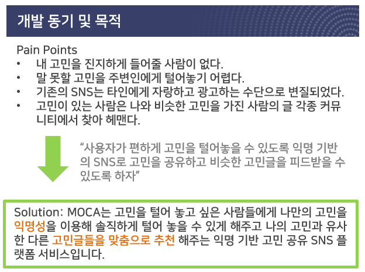
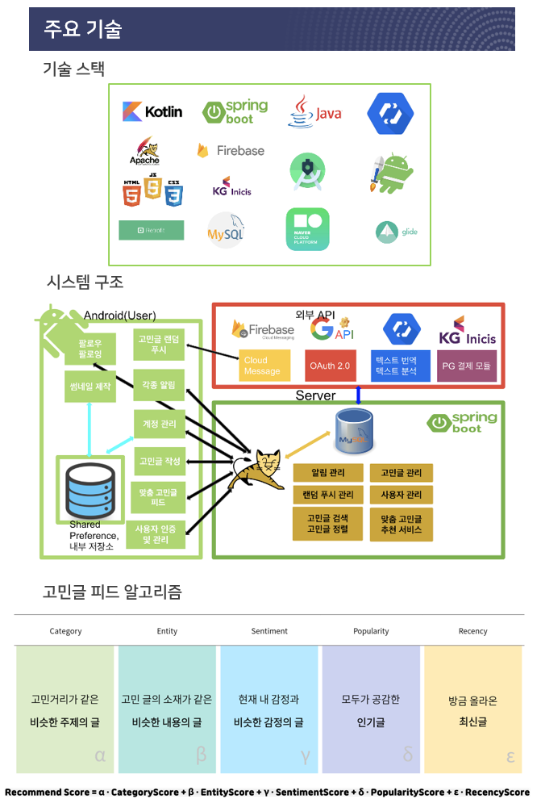
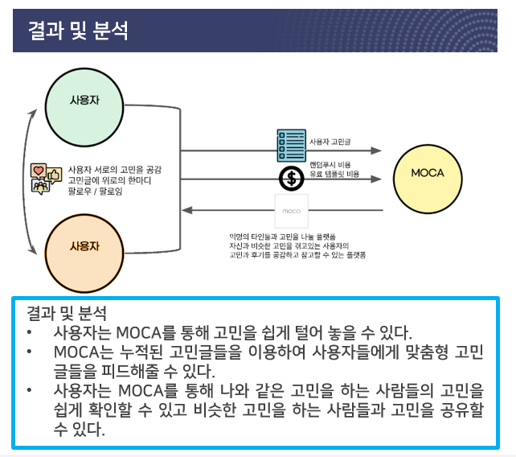

# Moca

* 팀명: OppaLab
* 개발자: 김현준, 김효균, 김성민 (안드로이드)


## Project Description








## Configuration

```kotlin
android {
    compileSdkVersion 30
    buildToolsVersion "30.0.1"

    defaultConfig {
        applicationId "com.oppalab.moca"
        minSdkVersion 26
        targetSdkVersion 30
        versionCode 1
        versionName "1.0"
        vectorDrawables.useSupportLibrary = true
        testInstrumentationRunner "androidx.test.runner.AndroidJUnitRunner"
    }
    ...
}
```


## Dependency

**CircleImageView**

```
implementation 'de.hdodenhof:circleimageview:3.1.0'
```

**Firebase module**

```
implementation platform('com.google.firebase:firebase-bom:25.12.0')
    implementation 'com.google.firebase:firebase-messaging-ktx:21.0.0'
    implementation 'com.google.firebase:firebase-core:18.0.0'
    implementation 'com.google.firebase:firebase-analytics:18.0.0'
    implementation 'com.google.firebase:firebase-auth:20.0.1'
    implementation 'com.google.firebase:firebase-database:19.5.1'
    implementation 'com.google.firebase:firebase-storage:19.2.0'
```

**Picasso**

```
implementation 'com.squareup.picasso:picasso:2.71828'
```

**Dexter**

```
implementation 'com.karumi:dexter:6.2.1'
```

**Image Filter**

```
implementation 'info.androidhive:imagefilters:1.0.7'
```

**Photo Editor**

```
implementation 'ja.burhanrashid52:photoeditor:1.1.0'
```

**Emoji**

```
implementation 'com.github.rockerhieu:emojicon:v1.4.2'
```

**Retrofit**

```
implementation 'com.squareup.retrofit2:retrofit:2.9.0'
    implementation 'com.squareup.retrofit2:converter-gson:2.9.0'
```

**Readmore TextView**

```
implementation 'kr.co.prnd:readmore-textview:1.0.0'
```

**App Intro**

```
implementation 'com.github.AppIntro:AppIntro:6.0.0'
```


## Project Structure

프로젝트 소스코드는 다음과 같이 구성된다.


**activity**:  Moca 서비스의 액티비티

**adapter**: Moca 서비스의 어댑터

**dto**: API 호출 시 넘겨주는 form-data 를 객체에 매핑

**fragment**: Moca 서비스의 프래그먼트

**interface**: 썸네일 제작 기능별 명세

**util**: Moca 서비스 구현 과정에 편의를 제공하는 유틸리티


## Specification


